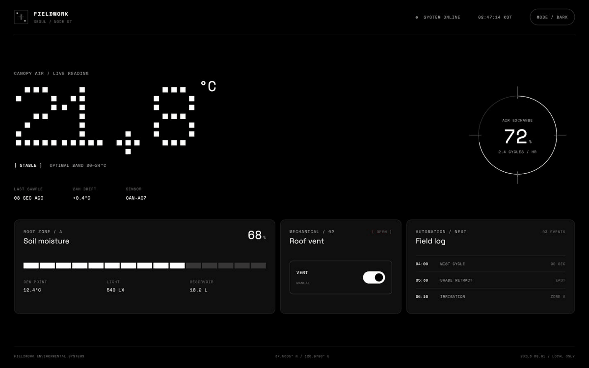

# Nothing Design for Codex

[English](./README.md) · **한국어**

Nothing의 시각 언어에서 영감을 받은 디자인 스킬을 패키징한 Codex 플러그인입니다. 단색, 타이포그래피 중심, 산업적인 인터페이스를 지향합니다.

이 저장소는 [dominikmartn/nothing-design-skill](https://github.com/dominikmartn/nothing-design-skill)을 Codex에서 사용할 수 있도록 수정한 버전입니다. 스위스 타이포그래피, OLED 블랙, 분할 진행 표시줄, 도트 매트릭스 모티프를 재사용 가능한 인터페이스 디자인 워크플로로 제공합니다.



## 제공 기능

`$nothing-design`을 호출하거나 프롬프트에 `Nothing 스타일` 또는 `낫싱 스타일`을 명시하면 다음 원칙에 따라 UI를 설계하거나 구현합니다.

- 화면을 주요 정보, 보조 정보, 메타데이터의 세 단계로 구성
- Doto, Space Grotesk, Space Mono 기반 타이포그래피
- 다크·라이트 모드 디자인 토큰 제공
- 분할 진행 표시줄, 기계식 토글, 계기판 형태의 컴포넌트 제공
- HTML/CSS, SwiftUI, React/Tailwind 출력 지원

## Codex 플러그인으로 설치 (권장)

Codex 플러그인은 Codex CLI에서 저장소 마켓플레이스를 추가한 뒤 바로 설치할 수 있습니다.

```sh
codex plugin marketplace add zjxps2007/Nothing_Design_Skill_For_Codex
codex plugin add nothing-design@nothing-design-for-codex
```

설치 여부를 확인합니다.

```sh
codex plugin list
```

스킬이 인식되도록 새 Codex 작업을 시작하세요. Codex 앱에서는 마켓플레이스를 추가한 뒤 **Plugins**에서 **Nothing Design for Codex**를 선택하고 **Install**을 눌러 설치할 수도 있습니다.

자세한 내용은 공식 [플러그인 패키징 안내](https://developers.openai.com/plugins/build/plugins)와 [Codex 플러그인 CLI 명령어](https://learn.chatgpt.com/docs/developer-commands?surface=cli#cli-codex-plugin)를 참고하세요.

### 업데이트

마켓플레이스를 새로 고친 뒤 최신 버전을 다시 설치합니다.

```sh
codex plugin marketplace upgrade nothing-design-for-codex
codex plugin add nothing-design@nothing-design-for-codex
```

### 스킬 수동 설치

사용 중인 Codex 버전이 아직 플러그인 명령을 지원하지 않는다면, 이 저장소를 클론한 뒤 패키지 안의 스킬을 Codex 스킬 디렉터리로 복사하세요.

```sh
mkdir -p ~/.codex/skills
cp -R ./plugins/nothing-design/skills/nothing-design ~/.codex/skills/
```

수동 설치 명령은 이 저장소의 루트에서 실행하고, 설치 후 새 Codex 작업을 시작하세요.

## 사용법

스킬 이름으로 직접 호출할 수 있습니다.

```text
$nothing-design React와 Tailwind로 반응형 시스템 모니터링 대시보드를 만들어줘.
```

또는 자연어로 Nothing 스타일을 명시해도 됩니다.

```text
기존 React 컴포넌트는 유지하고 이 설정 화면을 Nothing 스타일로 변경해줘.
```

일반적인 UI 요청에는 자동으로 적용되지 않으며, Nothing 디자인 언어를 명시적으로 요청할 때 사용됩니다.

## 데모

이 저장소에는 스킬의 타이포그래피, 위계, 토큰, 컴포넌트 규칙을 적용한 반응형 **FIELDWORK / NODE 07** 대시보드 데모가 포함되어 있습니다. Nothing의 로고나 제품 이미지는 사용하지 않았습니다.

```sh
python3 -m http.server 4173
```

브라우저에서 `http://localhost:4173/demo/`을 여세요. 다크·라이트 모드 전환과 기계식 환기구 스위치를 직접 조작할 수 있습니다.

## 구성

| 파일 | 설명 |
|------|------|
| `.agents/plugins/marketplace.json` | `codex plugin`에서 사용하는 저장소 마켓플레이스 |
| `plugins/nothing-design/.codex-plugin/plugin.json` | Codex 플러그인 매니페스트 |
| `plugins/nothing-design/skills/nothing-design/SKILL.md` | 디자인 철학, 제작 규칙, 작업 흐름 |
| `plugins/nothing-design/skills/nothing-design/agents/openai.yaml` | Codex UI 메타데이터와 기본 호출 프롬프트 |
| `demo/` | 반응형 HTML/CSS/JavaScript 데모 |
| `plugins/nothing-design/skills/nothing-design/references/tokens.md` | 색상, 글꼴, 간격, 모션 토큰 |
| `plugins/nothing-design/skills/nothing-design/references/components.md` | 버튼, 카드, 목록, 표, 오버레이 패턴 |
| `plugins/nothing-design/skills/nothing-design/references/platform-mapping.md` | HTML/CSS, React/Tailwind, SwiftUI, 목업 매핑 |

## 라이선스

MIT
